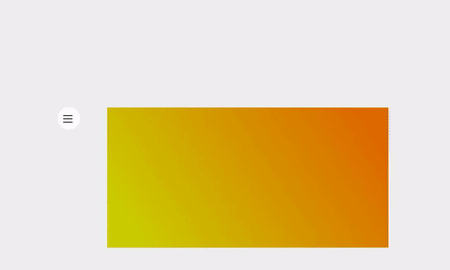

# weatherapp

You can checkout the weather🌡️ of a few cities🌆.
The background does change color with the 🌧️ temperature ☀️. 
Playing around with openweathermap API's and tilt.js library.

## Improvements 
- Should have hidden the Api key, just it's not that important of an api
- The side menu is absolutely not aligned, and the sizing of the thing is avg.

-> amirlerouge.github.io/weatherapp
